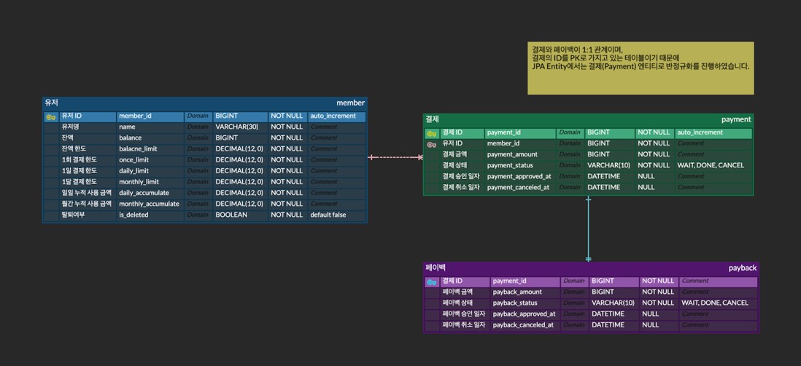

# lemontree-interview

## 목차

- [요구사항](#요구사항)
    - [기능 요구사항](#기능-요구사항)
    - [기타 요구사항](#기타-요구사항)
    - [고려사항](#고려사항)
    - [필요 결과물](#필요-결과물)
- [개발 환경](#개발-환경)
- [요구사항 분석](#요구사항-분석)
    - [핵심 요구사항](#핵심-요구사항)
    - [데이터베이스 설계](#데이터베이스-설계)
- [생각 정리](#생각-정리)
- [동시성 테스트 (고민 거리)](#과연-내-코드는-내-의도대로-동시성-문제에-대응하고-있을까)
- [느낀점](#느낀점)

## 요구사항

### 기능 요구사항

- 각 유저는 현재 가지고 있는 금액을 저장하고 있습니다.
- 현재 유저는 가입상태거나 탈퇴일 수 있습니다.
- 유저마다 보유할 수 있는 최대 한도가 있고, 서로 다를 수 있습니다.
- 동일한 결제/취소가 중복해서 일어날 수 있습니다.
- 동일한 결제/취소가 '동시에' 중복해서 일어날 수 있습니다.
- 거래(결제/취소, 페이백/페이백 취소) 실행은 5초의 제한 시간이 주어집니다.
- 각 유저는 1회/1일/1달의 결제 한도를 가지고 있습니다.

### 기타 요구사항

- DB Schema 첨부 (MySQL)
- 사용자의 인증 부분 자체는 따로 고려하지 않고 파라미터 유저 ID로 대체합니다.

### 고려사항

- 어떤 상황에서든 결제는 1건당 1회가 일어나야 합니다.
- 결제에 실패한다면 어느 시점에서 틀어지는지를 알 수 있어야 합니다.
- 100% 완성되지 않은 경우 고민거리와 이에 대한 부분을 문서로 남기주세요.
- 결제/취소, 페이백/페이백 취소 로직 구현에 집중 해주세요.

### 필요 결과물

1. 본인이 해당 프로젝트에서 발생할 수 있는 위험요소, 그리고 이를 어떻게 해결할지에 대해 정리한 문서
2. 발생할 수 있는 문제와 이에 대한 해결책 (비용 측면 또는 성능 측면 등)
3. Github에 올리고 해당 링크 공유 혹은 첨부파일

---

## 개발 환경

- Maven
- Java 17
- Spring Boot 3.3.2
- Spring Data JPA
- MySQL 8.x
- Lombok
- H2 (Test)
- JUnit 5
- Spring REST Docs (API 문서화)
    - [이미지 파일](docs/img/API문서.png)
    - WEB 문서는 `mvn clean package` 후 `localhost:8080/index.html` 접속

---

## 요구사항 분석

### 핵심 요구사항

- 거래를 진행할 때 오류가 발생하지 않는 것이 가장 중요하다.
- 하지만, 오류가 발생하더라도 어느 시점에서 발생했는지 파악할 수 있어야 한다.

#### 유저

> MySQL에서는 `user`라는 키워드가 존재하기 때문에 `member`로 대체합니다.

- 현재 보유 금액
- 상태 (가입 / 탈퇴)
- 보유 가능한 최대 한도가 존재 (유저마다 다름)
- 1회/1일/1달 결제 한도가 존재

#### 나의 접근 방법

- 상태를 나타내는 변수 (`isDeleted`)를 Soft Delete 하는 방식으로 적용
- 결제 한도 필드 (`xxxLimit`) 를 통해 결제를 진행할 때 체크
- 또한, 일/월 누적 금액을 저장하는 필드 (`xxxAccumulate`) 를 통해 결제를 진행할 때 체크
- 누적 금액은 Spring Scheduling Task (`@Scheduler`) 사용하여 누적 금액 초기화

> 머니 결제 API 요청시 발생할 수 있는 예외
> 1. 잔액 부족
> 2. 1회 결제 한도 초과 (onceLimit)
> 3. 1일 결제 한도 초과 (dailyLimit)
> 4. 1달 결제 한도 초과 (monthlyLimit)

#### 거래 (결제/페이백)

> `거래(trade)`를 중요한 객체로 보고, `결제(payment)`와 `페이백(payback)`에 대한 정보를 가지고 있게 설계하였습니다.

- 중복 요청을 하는 상황 등 어떤 상황에서든 거래는 **1건당 1회!**
- 오류 발생시 **어느 시점**에서 실패했는지 파악 가능하게

#### 나의 접근 방법

- 거래와 결제, 페이백이 각각 `1:1 관계`로 매핑할 수 있지만, 거래 하나의 테이블에 저장도록 진행
    - **@OneToOne** 연관관계를 사용할 수도 있지만, LAZY Loading이 안되는 점, 조회의 편의성 등을 고려하였습니다.
    - 또한, 트랜잭션 하나의 단위로 묶기 위해 하나의 테이블에 저장
- 높은 격리 수준(**REPEATABLE READ**)을 사용
- `Lock` 을 사용하여 접근 권한을 제한하는 방식 사용
- 결제/페이백 시스템에서 `동시성 제어`가 가장 핵심적으로 판단
- 격리 수준과 락에 따른 **trade-off (dead lock)** 대응 방법은?

> **거래의 흐름도**
> 1. 클라이언트가 거래 요청 (결제 금액, 페이백 금액 정보를 함께 전달)
> 2. 결제를 원하는 경우, 결제 API 호출
> 3. 완료된 결제인 경우, 페이백 API를 호출하여 페이백을 진행할 수 있음.

#### 결제

- 결제 금액만큼 유저의 보유 금액(`balance`)을 차감합니다.
- 또한, 누적 금액에 결제 금액을 더합니다.

_예외 사항_

- 1회 결제 한도 초과
    - 유저의 1회 결제 한도와 결제 금액을 비교하여 초과했는지 확인
- 1일/1달 결제 한도
    - 유저의 누적 결제 금액과 비교하여 초과했는지 확인
- 잔액 부족
    - 유저의 현재 보유 금액과 결제 금액을 비교하여 부족한지 확인

#### 결제 취소

- 결제가 완료된 건에 대해서만 취소를 진행할 수 있도록 합니다.
- 페이백이 진행된 결제건일 경우 페이백 또한 같이 취소됩니다.
- 결제 금액만큼 유저의 보유 금액(`balance`)을 증가합니다.
- 또한, 결제 일자와 취소를 요청한 시점이 같은 일, 같은 달인 경우 누적 금액을 수정합니다.

_예외 사항_

- 보유 한도 초과
    - 취소 후 유저가 보유한 금액이 한도를 초과하는지 확인

_특이 사항_

- 페이백 완료 상태
    - 결제 취소 시 페이백이 완료된 상태라면 페이백 취소도 같이 진행합니다.
    - 이 과정에서의 문제점이 존재하여 [생각 정리 - 결제 취소와 페이백 취소](#결제-취소와-페이백-취소---미해결)에 기록 (동일 트랜잭션으로 보는게 맞는가?)

#### 페이백

- 결제가 완료된 건에 대해서만 페이백을 진행할 수 있도록 합니다.
- 결제 요청에서 받았던 페이백 금액만큼 유저의 보유 금액(`balance`)을 증가합니다.

_예외 사항_

- 결제 상태 확인
    - 결제가 성공적으로 완료된 건에 대해서만 페이백을 진행

- 보유 한도 초과
    - 페이백 후 유저가 보유한 금액이 한도를 초과하는지 확인

#### 페이백 취소

- 페이백이 완료된 건에 대해서만 취소를 진행할 수 있도록 합니다.
- 페이백 금액만큼 유저의 보유 금액을 차감합니다.

_예외 사항_

- 보유 금액 부족
    - 페이백을 취소할 경우 유저의 보유 금액을 차감해야 함
    - 이 때, 보유 금액이 음수가 되는지 확인이 필요

_특이 사항_

- 페이백 금액이 0원 이상인 경우에만 유저 보유 금액을 차감

<br/>

### 데이터베이스 설계

#### ER Diagram



> 분석한 요구사항을 토대로 ERD를 작성하였습니다.

- 결제와 페이백의 경우 1:1 관계라고 생각하여 ERD 내에선 두 테이블로 분리하였지만, 실제 데이터베이스에서는 한 개의 테이블 (거래, trade) 로 구성하였습니다.

#### DB Schema

```sql
-- DB: lemontree

DROP TABLE IF EXISTS payment;
DROP TABLE IF EXISTS member;

CREATE TABLE `member`
(
  member_id          BIGINT AUTO_INCREMENT PRIMARY KEY,
  name               VARCHAR(30)    NOT NULL,
  balance            DECIMAL(12, 0) NOT NULL,
  balance_limit      DECIMAL(12, 0) NOT NULL,
  once_limit         DECIMAL(12, 0) NOT NULL,
  daily_limit        DECIMAL(12, 0) NOT NULL,
  monthly_limit      DECIMAL(12, 0) NOT NULL,
  daily_accumulate   DECIMAL(12, 0) NOT NULL,
  monthly_accumulate DECIMAL(12, 0) NOT NULL,
  is_deleted         BOOLEAN        NOT NULL DEFAULT FALSE
) ENGINE = InnoDB
  DEFAULT CHARSET = utf8mb4;

CREATE TABLE `trade`
(
  trade_id            BIGINT AUTO_INCREMENT PRIMARY KEY,
  member_id           BIGINT         NOT NULL,
  payment_amount      DECIMAL(12, 0) NOT NULL,
  payment_status      VARCHAR(10)    NOT NULL,
  payback_amount      DECIMAL(12, 0) NOT NULL,
  payback_status      VARCHAR(10)    NOT NULL,
  payment_approved_at DATETIME       NULL,
  payment_canceled_at DATETIME       NULL,
  payback_approved_at DATETIME       NULL,
  payback_canceled_at DATETIME       NULL,

  FOREIGN KEY (member_id) REFERENCES member (member_id) ON DELETE CASCADE,
  INDEX idx_payment_member_id (member_id)
) ENGINE = InnoDB
  DEFAULT CHARSET = utf8mb4;

```

#### DB Engine - InnoDB를 사용한 이유

> InnoDB vs MyISAM

- InnoDB
    - 트랜잭션을 지원
    - 우수한 성능 (다수 동시접속 및 대용량 처리)
    - 장애 복구 기능
- MyISAM
    - 읽기 위주의 작업만 필요한 경우 유리 (조회 및 검색)
    - 트랜잭션이나 복구 기능이 필요 없는 경우 주로 사용
    - 한 번에 대량의 데이터를 입력하는 배치성 테이블

중요 데이터를 다루는 결제 시스템에서는 트랜잭션 및 대용량 처리, 장애 복구 등의 기능을 제공하는 InnoDB를 사용하는 것이 유리하다고 판단하였습니다.

#### Connection Pool - HikariCP를 사용한 이유

> DBCP2 vs HikariCP

- DBCP2
    - 오랫동안 사용되어 안정적인 라이브러리인 점
    - 여러가지 설정을 할 수 있어 다양한 기능을 커스터마이징 할 수 있음.
    - 하지만, 설정이 복잡하며 성능이 떨어진다는 단점이 존재

- HikariCP
    - 설정이 간단하고, 성능이 뛰어나다고 알려져 있음. (대규모 트랜잭션을 처리할 때 유리할 것이라고 예상)
    - 하지만, 최신 라이브러리이기 때문에 DBCP2에 비해 안정성이 떨어질 수 있으며, 다양한 설정을 할 수 없다는 단점이 존재

높은 격리 수준과 락을 사용할 것이기 때문에, 트랜잭션을 처리할 때 더 나은 성능을 낼 수 있는 HikariCP를 사용하는 것이 적합하다고 판단하였습니다.

```properties
# hikariCP Connection Pool
spring.datasource.hikari.connection-timeout=3000
spring.datasource.hikari.validation-timeout=2000
spring.datasource.hikari.idle-timeout=50000
spring.datasource.hikari.max-lifetime=50000
spring.datasource.hikari.minimum-idle=15
spring.datasource.hikari.maximum-pool-size=15
```

- `connection-timout`: 커넥션 풀에서 커넥션을 얻기 위해 대기할 수 있는 최대 시간 (초과시, SQLException)
- `validation-timeout`: DB 연결 검증하는데 사용할 수 있는 최대 시간 (초과시, 연결이 유효하지 않은 것으로 간주)
- `idle-timout`: 커넥션 풀에 반환된 후 커넥션 풀에서 제거되기까지의 시간
- `max-lifetime`: 커넥션 풀에서의 커넥션의 최대 수명으로, 이 시간이 지나면 풀에서 제거되고 새 커넥션으로 대체
- `minimum-idle`: 최소한으로 유지할 수 있는 최소 커넥션 수
- `maximum-pool-size`: 커넥션 풀에서 유지할 수 있는 최대 커넥션 수

> maximum-pool-size 와 minimum-idle 수를 일치시켜 최대한 높은 성능을 낼 수 있도록 설정하였습니다.


<br/>

## 생각 정리

> 과제를 진행하면서 요구사항을 해결하기 위해 접근한 방법과 해결한 방법, 그리고 생각한 점들을 정리하였습니다.  
> 해결하지 못하였을 경우, 어떤 문제점이 있었는지 정리하였습니다.

### 돈 관련 타입 (BigDecimal vs Double vs Long)

- 현재 요구사항에는 결제 후 페이백을 지급하는 비즈니스 로직이 존재한다.
- 페이백이 고정된 값 (ex. 1000원)이 아닌, 일정 비율로 제공되어야 할 경우라면?
- float, double은 부동소수점 방식으로 인해 정확한 계산이 불가능함.
- BigDecimal은 정확한 계산이 가능하나, 무거운 객체이기 때문에 성능적인 측면에서 고려해야 함.

부동소수점의 한계를 가진 float, double을 사용하는 것은 적절하지 않은 것 같음.
할인율이나 페이백의 요구사항이 변경될 수 있다는 점 등 확장성을 고려하여 BigDecimal을 사용하는 것이 적절해보임.

성능적 측면에서 무거운 객체를 사용한다는 점은 문제가 되지만, '돈'과 관련된 API에선 정확성이 최우선이라고 판단

### 누적 금액 초기화 (JPQL)

**Spring Scheduling Task** 를 사용하여 누적 금액 초기화를 진행하였습니다.

_Scheduler 테스트_


12시에 dailyAccumulate 초기화

```json
{
  "memberId": 1,
  "name": "정승조",
  "balance": 94000,
  "onceLimit": 5000,
  "dailyLimit": 10000,
  "monthlyLimit": 15000,
  "dailyAccumulate": 0,
  "monthlyAccumulate": 6000,
  "isDeleted": false
}
```

**유저 누적 금액 초기화 메서드**

```java
public interface MemberRepository extends JpaRepository<Member, Long> {

    /**
     * 모든 유저의 일일 누적 금액(daily_accumulate)을 0으로 초기화합니다.
     */
    @Modifying(clearAutomatically = true)
    @Query(value = "UPDATE Member m SET m.dailyAccumulate = 0")
    void resetDailyLimit();


    /**
     * 모든 유저의 월간 누적 금액(monthly_accumulate)을 0으로 초기화합니다.
     */
    @Modifying(clearAutomatically = true)
    @Query(value = "UPDATE Member m SET m.monthlyAccumulate = 0")
    void resetMonthlyLimit();

    // ...
}
```

회원의 일일/월별 누적 금액을 매일/매월 초기화시켜주는 쿼리를 작성하였습니다. _(Scheduler를 사용하여 매일/매월 초기화)_

- JPA Entity (Lazy Loading)를 사용하기 때문에, 캐싱을 통한 **영속성 컨텍스트** 내의 데이터와 DB의 데이터 불일치가 발생할 수 있습니다.
- 이를 해결하기 위해 `@Modifying` 어노테이션의 **clearAutomatically** 값을 true로 설정하면, 해당 쿼리를 실행 후 영속성 컨텍스트를 clear 하는 과정이 진행되어 데이터 불일치를
  방지할 수 있습니다.

> _JPQL을 사용한 이유_
>
> - JPQL을 사용할 경우, 유지보수에 유연하며 코드 작성 시점에 오류를 잡을 수 있습니다.
> - 또한, 객체지향적인 코드를 작성하고, DB에 종속되지 않는 코드를 작성할 수 있습니다.
> - 결정적으로, **Soft Delete**를 사용하기 때문에, 탈퇴한 회원에 대한 불필요한 처리가 발생하지 않습니다.
>
> 물론, 속도적 측면에서 nativeQuery가 빠르고, Querydsl을 사용하여 컴파일 시점에 오류를 잡을 수 있지만, 단순 쿼리문 작성 시에는 JPQL을 사용하는 것이 유리하다고 판단하였습니다.

### 동시성 제어

- 격리 수준(Isolation Level) 은 Connection 단위로만 적용이 가능하다.
- 이 말은 즉, 한 트랜잭션에서 'SELECT' 한 'ROW' 에 대해 다른 트랜잭션에서 수정을 시도할 때 격리 수준을 설정할 수 없다는 것이다.
- 이러한 문제점은 '락(Lock)' 을 사용해야 한다.

그렇다면 어떤 격리 수준과 락을 사용해야 할까?

#### 격리 수준

> SERIALIZABLE 격리 수준은 성능이 상당히 떨어지기 때문에 '극단적'으로 안전한 상황에만 사용하라 했는데?..

- 결제 시스템의 경우 **동시성 제어**가 가장 중요하다.
- 특히, 요구사항처럼 어떤 상황에서든 `1건당 1회` 가 일어나야 하는 경우 격리 수준을 높게 설정하는 것은 당연한 것 같다.

- READ UNCOMMITTED, READ COMMITED 격리 수준은 결제 시스템에 적합하지 않은 것 같다.
    - READ UNCOMMITTED: 커밋되지 않은 데이터를 읽을 수 있음. (dirty read)
    - READ COMMITTED: 커밋된 데이터만 읽을 수 있다. (non repeatable read)

그렇다면, REPEATABLE READ / SERIALIZABLE 둘 중 어느 격리 수준을 선택해야 할까?

**REPEATABLE READ**

- MySQL의 기본 격리 수준이며, 트랜잭션이 롤백될 가능성에 대비하여 변경 전 레코드를 Undo 영역에 저장
- 동일한 트랜잭션 내에서는 동일한 결과를 보장하지만, 다른 트랜잭션의 경우 팬텀 리드가 발생할 수 있다.
- 하지만, **InnoDB**를 사용하는 경우에는 REPEATABLE READ 격리 수준에서 팬텀 리드가 발생하지 않는다. (일반적인 SELECT 쿼리 한정)

**SERIALIZABLE**

- 가장 단순하고, 엄격한 격리 수준이다.
- 한 트랜잭션에서 읽고 쓰는 레코드를 다른 트랜잭션에서 **절대** 접근할 수 없다.
- 성능적으로 매우 떨어지기 때문에, 극단적인 상황이 아니면 사용하지 않는 것을 권장한다.

현재 InnoDB를 사용하고 있기는 하다. 따라서 팬텀 리드를 방지할 수 있고, 성능적으로도 REPEATABLE READ 격리 수준을 사용하는 것이 적합하다고 생각하였습니다.

> [과연 MySQL의 REPEATBLE READ에서는 PHANTOM READ 현상이 일어나지 않을까?](https://parkmuhyeun.github.io/woowacourse/2023-11-28-Repeatable-Read/)

### Lock

요구사항 중 `1건당 1회`의 결제/페이백을 보장해야 한다는 내용이 존재한다. 이 말은 즉, 동시성 문제를 어떻게 해결해야 할까? 에 대한 고민으로 이어졌다.

Java의 synchronized 키워드를 사용하는 것처럼 exclusive lock 같은 방식으로 동시성 문제를 제어할 수는 없을까?

**낙관적 락(Optimistic Lock)**

- 낙관적 락은 데이터를 조회할 때 다른 트랜잭션에서 수정하지 않을 것이라고 가정한다.
- `@Version` 어노테이션이나, `@Lock(LockModeType.OPTIMISTIC)` 과 같은 방식으로 Java 에서 구현할 수 있다.
- 실제로 락을 거는 방식이 아니여서 성능이 좋지만, 충돌이 발생했을 경우 (`ObjectOptimisticLockingFailureException`) 직접 예외 처리를 해줘야 한다.

_정리하자면,_

- 데이터를 업데이트 할 때 버전을 체크하여 충돌 여부를 판단해야 함.
- 동시에 같은 데이터를 변경하려는 경우가 적은 상황에서 사용하는 것이 적합한 것 같다.

**비관적 락(Pessimistic Lock)**

- 데이터를 조회할 때 부터 락을 걸어 다른 트랜잭션에서 접근할 수 없게 한다.
- `@Lock(LockModeType.PESSIMISTIC_WRITE)` 와 같은 방식으로 Java 에서 구현할 수 있다.
- 성능 저하와 데드락 발생 가능성이 높다는 큰 단점이 존재한다.

_정리하자면,_

- 한 트랜잭션이 데이터를 점유하는 방식이며, 다른 트랜잭션에서 접근을 못한다.
- **'데이터 일관성'** 을 보장하는 방식이기 때문에 금융 시스템처럼 데이터 일관성이 중요한 곳에서 사용하는 것이 적합한 것 같다.

### 결론

현재의 요구사항을 대입해보자면, 비관적 락을 사용하여 유저가 결제/페이백을 진행할 때 동시에 접근하지 못하도록 막는 것이 적합하다고 판단했습니다.   
따라서, `비관적 락(Pessimitic Lock)` 을 사용하여 동시성 문제를 해결하였습니다.

_MemberRepository.java_

```java
public interface MemberRepository extends JpaRepository<Member, Long> {

    // ...

    /**
     * 유저 ID로 유저 정보를 조회합니다. (비관적 락 사용)
     *
     * @param id 유저 ID
     * @return 유저 정보
     */
    @Lock(LockModeType.PESSIMISTIC_WRITE)
    Optional<Member> findWithPessimisticLockById(Long id);
}
```

_PaymentRepository.java_

```java
public interface PaymentRepository extends JpaRepository<Payment, Long> {

    /**
     * 결제 ID로 결제 정보를 조회합니다. (비관적 락 사용)
     *
     * @param paymentId 결제 ID
     * @return 결제 정보
     */
    @Lock(LockModeType.PESSIMISTIC_WRITE)
    Optional<Payment> findWithPessimisticLockById(Long paymentId);
}

```

### 결제 취소와 페이백 취소 - 미해결

#### 문제 상황

1. 결제 취소를 진행
2. 결제 취소 로직 중 결제의 상태를 `CANCEL`로 변경 (Dirty Checking)
3. 이후, 페이백도 진행된 경우, 페이백 서비스의 취소 메서드를 호출
4. 취소 메서드의 트랜잭션 내에서 결제 정보를 조회할 때 이미 `CANCEL`로 변경된 상태
5. 따라서, 페이백 취소 로직이 실행되지 않음

#### 해결 방안

- PaymentStatus 수정 시점을 후순위로 변경

#### 문제점

`REQUIRES_NEW` 를 통해 개별 트랜잭션으로 분리하려고 하였지만, 비관적 락을 사용하여 동시성 제어를 하고 있기 때문에 같은 트랜잭션으로 묶이지 않는 이상, 오류가 발생함..

`REQUIRED(default)` 옵션을 사용하여 같은 트랜잭션으로 묶어서 처리하였지만 아래와 같은 문제점이 발생할 것으로 예상됨.

- 결제 취소와 페이백 취소가 1개의 트랜잭션으로 묶이다보니, 페이백 취소에서 문제가 발생하면 결제 취소도 안되버리는 큰 문제점이 존재함.
- 결제 취소와 페이백 취소를 각각 개별 트랜잭션으로 관리를 해야 할 것 같지만, 결제 취소 로직에서 회원에 대한 정보를 조회할 때 비관적 락을 사용하여 가져오기 때문에 무조건 오류가 발생하는 문제점이 계속해서
  존재
- 이러한 경우 동시성 제어를 어떻게 해야할지 고민이 필요함

### 유효성 검사

- Controller Layer 로 들어오는 DTO 객체에 대한 유효성 검사는 `jakarta.validation.constraints` 를 사용하여 처리하였음.
- 하지만, 구체적인 검사 (ex. 보유 금액보다 보유 한도가 더 큰 경우) 는 어디서 진행해야 되는가?

#### 기존 방식

- Entity 인스턴스 생성하기 전, precondition 을 통해 검사를 진행
- 생성자 내부에서 검사를 진행하여, 객체 생성 시점에 오류를 잡음

#### 접근 방법 및 변경

- `Fail Fast` 원칙을 따르려면, Entity 객체를 생성하기 전에 Service Layer 에서 검사를 진행하고 예외를 던지는 것이 맞지 않을까?
- 비즈니스 로직을 처리하는 레이어인 Service Layer 에서 Entity 인스턴스 생성이 가능한지 체크하는 방식으로 변경

<br/>

## 과연 내 코드는 내 의도대로 동시성 문제에 대응하고 있을까?

### 1. 결제 시스템에서 동시성 문제가 발생할 수 있는 경우

1) 결제 요청 및 취소를 여러번 한 경우
2) 페이백 요청 및 취소를 여러번 한 경우

- 결제를 실수로 여러번 요청한 경우에도 1회만 결제가 이루어져야 한다.
- 결제 취소도 위와 같다.

#### 동시성 문제 발생 이유

- 유저의 실수 (human error), 네트워크 지연 등의 문제로 인해 결제 요청이 여러번 발생할 수 있다.
- 각 요청이 독립적으로 처리되어 결제가 여러번 이루어질 수 있다는 문제가 존재함.

#### 기대하는 동작

- 유저가 여러 번 결제를 요청해도 단 한 번만 결제가 이루어져야 한다.
- 이 말은 즉, 유저의 잔액이 여러 번 차감되어서는 안된다는 것을 의미한다.

### 2. 동시성 이슈 대응

- Service Layer 에 `@Transactional` 어노테이션을 통해 트랜잭션을 관리함.
- 또한, `@Lock` 어노테이션을 통해 비관적 락을 걸어 Member Entity의 잔액을 동시성 문제에 대응함.

_PaymentService.java - 결제 요청 메서드_

```java

@Slf4j
@Service
@RequiredArgsConstructor
public class PaymentService {

    private final PaybackService paybackService;
    private final PaymentRepository paymentRepository;
    private final MemberRepository memberRepository;

    // ...

    /**
     * 결제 요청을 한 유저 정보를 조회하고 요구사항에 맞게 결제를 진행합니다.
     *
     * @param memberId 결제를 진행할 유저의 ID
     * @param request  결제 요청 정보 (결제 금액)
     */
    @Transactional(timeout = 5, isolation = Isolation.REPEATABLE_READ)
    public Long processPayment(Long memberId, PaymentRequest request) {

        // 비관적 락을 사용하여 멤버 정보를 조회합니다.
        Member member = memberRepository.findWithPessimisticLockById(memberId)
                .orElseThrow(MemberNotFoundException::new);

        // 한도 초과 및 잔액 부족 체크 후 결제 진행
        checkLimitAndBalance(member, request.getPaymentAmount());
        member.pay(request.getPaymentAmount());

        Payment payment = Payment.builder()
                .memberId(memberId)
                .paymentAmount(request.getPaymentAmount())
                .paybackAmount(request.getPaybackAmount())
                .build();

        Payment savedPayment = paymentRepository.save(payment);

        // 결제 완료 상태로 변경
        savedPayment.completePayment();

        log.info("결제가 완료되었습니다. [결제 ID = {}]", savedPayment.getId());

        return savedPayment.getId();
    }

    // ...
}
```

- `@Transactional` 어노테이션을 통해 트랜잭션을 관리하고, `Isolation.REPEATABLE_READ` 레벨로 설정하여 동시성 문제에 대응함.
- `@Lock` 어노테이션을 통해 비관적 락을 걸어 Member Entity의 잔액을 동시성 문제에 대응함.

### 3. 테스트

_테스트1. 10번의 시도 - 성공_

```java

@Test
@DisplayName("결제 비관적 락 테스트 - 10번 동시에 결제해도 1번만 결제된다.")
void payment_lock() throws Exception {

    Member member = Member.builder()
            .name("정승조")
            .balance(BigDecimal.valueOf(10000L))
            .balanceLimit(BigDecimal.valueOf(100000L))
            .onceLimit(BigDecimal.valueOf(5000L))
            .dailyLimit(BigDecimal.valueOf(10000L))
            .monthlyLimit(BigDecimal.valueOf(15000L))
            .isDeleted(Boolean.FALSE)
            .build();

    Member savedMember = memberRepository.save(member);

    // 5000원 결제 요청
    PaymentRequest paymentRequest = new PaymentRequest();
    ReflectionTestUtils.setField(paymentRequest, "paymentAmount", BigDecimal.valueOf(5000L));
    ReflectionTestUtils.setField(paymentRequest, "paybackAmount", BigDecimal.valueOf(1000L));

    // 동시에 결제를 진행하는 테스트
    AtomicInteger success = new AtomicInteger(0);
    AtomicInteger fail = new AtomicInteger(0);
    int threadCount = 10;

    ExecutorService executorService = Executors.newFixedThreadPool(threadCount);
    CountDownLatch startLatch = new CountDownLatch(1);  // 모든 스레드가 동시에 시작하도록 조정하는 용도
    CountDownLatch latch = new CountDownLatch(threadCount);  // 모든 스레드의 작업이 끝날 때까지 기다리기 위한 용도

    for (int i = 0; i < threadCount; i++) {
        executorService.execute(() -> {
            try {
                startLatch.await();  // 모든 스레드가 준비되길 기다림
                paymentService.processPayment(savedMember.getId(), paymentRequest);
                success.incrementAndGet();
            } catch (Exception e) {
                fail.incrementAndGet();
            } finally {
                latch.countDown();  // 스레드가 종료되면 latch 감소
            }
        });
    }

    // 모든 스레드가 준비되면 startLatch 해제하여 동시에 시작하게 함
    startLatch.countDown();

    // 모든 스레드가 작업을 마칠 때까지 기다림
    latch.await();

    // then
    Member findMember = memberRepository.findById(savedMember.getId()).get();
    assertEquals(0, findMember.getBalance().compareTo(BigDecimal.valueOf(5000L)));
    assertEquals(0, findMember.getDailyAccumulate().compareTo(BigDecimal.valueOf(5000L)));
    assertEquals(0, findMember.getMonthlyAccumulate().compareTo(BigDecimal.valueOf(5000L)));

    assertEquals(1, success.intValue());
    assertEquals(9, fail.intValue());
    assertEquals(threadCount, success.intValue() + fail.intValue());
}
```

**테스트코드 설명**

- 10개의 스레드를 사용하여 동시에 한 회원이 5000원 결제를 10번 요청한다.
- 각 스레드는 회원를 조회하고, 한도 및 잔액을 체크한 후 결제를 진행한다.

_테스트2. 100번의 시도 - 실패_


- 스레드 수를 100개로 늘려서 결제를 요청하면, 100번의 결제 요청 중 2건의 결제가 성공하게 된다.
- 이는 동시성 문제로 인해 발생한 문제이다.

#### 문제 분석

- 현재 프로젝트에서는 Connection Pool (HikariCP)를 사용하여 미리 사용할 커넥션을 가지고 있음
- 지정해놓은 커넥션 수를 초과하는 요청이 들어오면, 대기열에 들어가서 순차적으로 처리됨
    - 백그라운드 스레드가 10개라고 가정하면, 100번의 요청을 보냈을 때 11번째 스레드가 커넥션 풀에 접근하려고 하면 대기열에 들어가게 됨
- 나머지 스레드들은 커넥션이 반환되기만을 기다리고 있음.
- 커넥션 풀의 크기에 따라 동시에 처리할 수 있는 스레드 수가 제한되어 있음.
- 테스트 결과, 커넥션 풀의 크기가 50개가 넘어갈 경우, 같은 수의 스레드가 요청해도 오류가 발생함.

#### 예상 해결 방안

```java

@Lock(LockModeType.PESSIMISTIC_WRITE)
Optional<Member> findWithPessimisticLockById(@Param("id") Long id);
```

- PESSIMISTIC_WRITE 를 통해 exclusive lock 을 걸었는데도 왜 접근이 되는거지?..


### 접근 방식 변경

- 유저가 결제를 요청하는 방식에서, 유저가 결제건을 미리 만들고 이후에 결제를 진행하는 방식으로 변경
- 해당 방식을 사용하여 비관적 락 + 상태 체크를 통해 동시성 문제를 해결하는 방식으로 진행

기존 방식에서는 결제 요청이 들어오면 같은 트랜잭션 내에서 결제 대기(WAIT) 상태 -> 결제 완료(DONE) 상태로 변경하는 방식으로 진행했는데 해당 방식은 좋지 않은 코드인 것 같아 리팩토링을
진행하였습니다.  
또한, 비관적 락을 걸었지만, 동일한 결제건이라는 것을 파악할 수 있는 방법이 존재하지 않아 동시성 문제를 해결하기 어려웠습니다.

### 변경된 방식

_PaymentService.java - 결제 요청 메서드_

```java

@Service
@RequiredArgsConstructor
public class PaymentService {

    // ...

    /**
     * 결제건을 생성합니다. (결제가 진행되는 것이 아닌, 진행해야되는 결제건을 생성합니다.)
     *
     * @param memberId 결제를 진행할 유저 ID
     * @param request  결제 요청 정보
     * @return 결제 ID
     */
    @Transactional
    public Long createPayment(Long memberId, PaymentRequest request) {

        if (!memberRepository.existsById(memberId)) {
            throw new MemberNotFoundException();
        }

        Payment payment = Payment.builder()
                .memberId(memberId)
                .paymentAmount(request.getPaymentAmount())
                .paybackAmount(request.getPaybackAmount())
                .build();

        Payment savedPayment = paymentRepository.save(payment);

        return savedPayment.getId();
    }

    /**
     * 결제를 진행합니다. 이 때, 비관적 락을 사용하여 멤버 정보를 조회하고 결제를 진행합니다.
     *
     * @param paymentId 결제 ID
     */
    @Transactional(timeout = 5, isolation = Isolation.REPEATABLE_READ)
    public void processPayment(Long paymentId) {

        // 비관적 락을 사용하여 결제 정보를 조회합니다. (결제 상태 및 결제 금액 변경을 막기 위함)
        Payment payment = paymentRepository.findWithPessimisticLockById(paymentId)
                .orElseThrow(PaymentNotFoundException::new);

        // 비관적 락을 사용하여 멤버 정보를 조회합니다. (잔액 변경을 막기 위함)
        Member member = memberRepository.findWithPessimisticLockById(payment.getMemberId())
                .orElseThrow(MemberNotFoundException::new);

        if (payment.getPaymentStatus() != PaymentStatus.WAIT) {
            throw new PaymentAlreadyProceedException();
        }

        checkLimitAndBalance(member, payment.getPaymentAmount());
        member.pay(payment.getPaymentAmount());

        payment.completePayment();
        log.info("결제가 완료되었습니다. [결제 ID = {}]", payment.getId());
    }

    //...
}
```

**변경된 방식**

- 결제건을 생성하면, 생성된 결제 ID를 반환한다.
- 결제를 진행하는 메서드에서 `비관적 락` 을 사용하여 결제를 조회하고, 결제 상태가 `WAIT` 인지 확인한다.


1000번의 요청에도 1건의 성공만 되도록 동시성 문제를 해결!

> 결제(취소)와 페이백(취소) 로직도 동일한 방식으로 변경하여 동시성 문제를 해결하였습니다.

### 더 나아가서,

- 커넥션 풀은 데이터베이스의 접근의 동시성을 관리하며, 애플리케이션 확장성을 향상시킨다.
- 하지만, 동시에 처리할 수 있는 요청의 수는 제한되어 있어 동시성 문제를 완벽하게 대응할 수는 없는 것 같다.

더 찾아보니, Redis Java Client 중 하나인 Redisson의 RLock을 활용하여 `분산 락`을 구현할 수 있다고 한다.

- MySQL도 분산락을 구현할 수 있지만, 락을 자동으로 반납하지 않는 점, DB에서 락을 관리하기 때문에 여전히 부담이 됨
- Lock을 사용하여, DB에 큰 부하를 주는 방식을 현재 사용하고 있기 떄문에, 분산 락을 구현한다면 더 나은 성능을 낼 수 있을 것 같다.

> [내가 알고있는 Lettuce, Jedis 가 아닌 Redisson 을 사용하는 이유](https://helloworld.kurly.com/blog/distributed-redisson-lock/#2-redis%EC%9D%98-redisson-%EB%9D%BC%EC%9D%B4%EB%B8%8C%EB%9F%AC%EB%A6%AC-%EC%84%A0%EC%A0%95-%EC%9D%B4%EC%9C%A0)

<br/>

## 느낀점

격리 수준, 락, 커넥션 풀 등의 기법을 적절히 활용하여 동시성 제어를 진행했지만, 여전히 완벽한 코드는 아닌 것 같다는 생각이 든다.

- 데이터 일관성, 무결성을 유지하기위해 경합 조건, 데드락, 성능 저하, 상태 관리 등의 문제를 생각해보는 계기가 됨.
- 처음으로 동시성 문제를 고려하면서 설계를 진행하다보니, 코드를 작성한 후 리팩토링을 진행하면서 더 나은 방법을 찾아보는 것이 중요하다는 것을 느낌.
- 접근한 방법과 해결 방법을 스스로 생각하고, 단순히 돌아가는 코드가 아닌 '더 좋은 방법은 없을까?'에 대해 계속 고민하게 됨.
