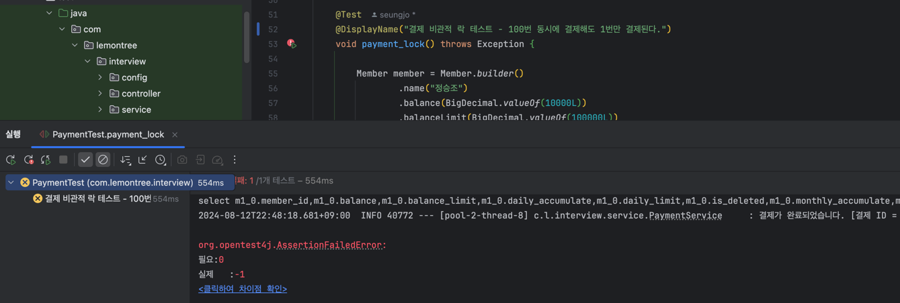
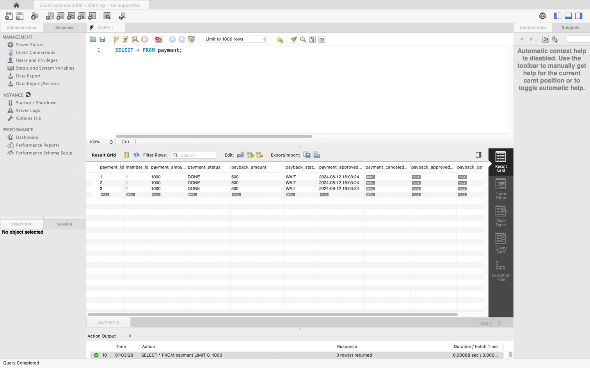

# 과연 내 코드는 내 의도대로 동시성 문제에 대응하고 있을까?

## 1. 결제 시스템에서 동시성 문제가 발생할 수 있는 경우

1) 결제 요청 및 취소를 여러번 한 경우
2) 페이백 요청 및 취소를 여러번 한 경우

- 결제를 실수로 여러번 요청한 경우에도 1회만 결제가 이루어져야 한다.
- 결제 취소도 위와 같다.

#### 동시성 문제 발생 이유

- 유저의 실수 (human error), 네트워크 지연 등의 문제로 인해 결제 요청이 여러번 발생할 수 있다.
- 각 요청이 독립적으로 처리되어 결제가 여러번 이루어질 수 있다는 문제가 존재함.

#### 기대하는 동작

- 유저가 여러 번 결제를 요청해도 단 한 번만 결제가 이루어져야 한다.
- 이 말은 즉, 유저의 잔액이 여러 번 차감되어서는 안된다는 것을 의미한다.


## 2. 동시성 이슈 대응 

- Service Layer 에 `@Transactional` 어노테이션을 통해 트랜잭션을 관리함.
- 또한, `@Lock` 어노테이션을 통해 비관적 락을 걸어 Member Entity의 잔액을 동시성 문제에 대응함.

_PaymentService.java - 결제 요청 메서드_ 

```java
@Slf4j
@Service
@RequiredArgsConstructor
public class PaymentService {

    private final PaybackService paybackService;
    private final PaymentRepository paymentRepository;
    private final MemberRepository memberRepository;

    // ...

    /**
     * 결제 요청을 한 유저 정보를 조회하고 요구사항에 맞게 결제를 진행합니다.
     *
     * @param memberId 결제를 진행할 유저의 ID
     * @param request  결제 요청 정보 (결제 금액)
     */
    @Transactional(timeout = 5, isolation = Isolation.REPEATABLE_READ)
    public Long processPayment(Long memberId, PaymentRequest request) {

        // 비관적 락을 사용하여 멤버 정보를 조회합니다.
        Member member = memberRepository.findWithPessimisticLockById(memberId)
                .orElseThrow(MemberNotFoundException::new);

        // 한도 초과 및 잔액 부족 체크 후 결제 진행
        checkLimitAndBalance(member, request.getPaymentAmount());
        member.pay(request.getPaymentAmount());

        Payment payment = Payment.builder()
                .memberId(memberId)
                .paymentAmount(request.getPaymentAmount())
                .paybackAmount(request.getPaybackAmount())
                .build();

        Payment savedPayment = paymentRepository.save(payment);

        // 결제 완료 상태로 변경
        savedPayment.completePayment();

        log.info("결제가 완료되었습니다. [결제 ID = {}]", savedPayment.getId());

        return savedPayment.getId();
    }

    // ...
}
```

- `@Transactional` 어노테이션을 통해 트랜잭션을 관리하고, `Isolation.REPEATABLE_READ` 레벨로 설정하여 동시성 문제에 대응함.
- `@Lock` 어노테이션을 통해 비관적 락을 걸어 Member Entity의 잔액을 동시성 문제에 대응함.

## 3. 테스트 

_테스트1. 10번의 시도 - 성공_

```java
    @Test
@DisplayName("결제 비관적 락 테스트 - 10번 동시에 결제해도 1번만 결제된다.")
void payment_lock() throws Exception {

    Member member = Member.builder()
            .name("정승조")
            .balance(BigDecimal.valueOf(10000L))
            .balanceLimit(BigDecimal.valueOf(100000L))
            .onceLimit(BigDecimal.valueOf(5000L))
            .dailyLimit(BigDecimal.valueOf(10000L))
            .monthlyLimit(BigDecimal.valueOf(15000L))
            .isDeleted(Boolean.FALSE)
            .build();

    Member savedMember = memberRepository.save(member);

    // 5000원 결제 요청
    PaymentRequest paymentRequest = new PaymentRequest();
    ReflectionTestUtils.setField(paymentRequest, "paymentAmount", BigDecimal.valueOf(5000L));
    ReflectionTestUtils.setField(paymentRequest, "paybackAmount", BigDecimal.valueOf(1000L));

    // 동시에 결제를 진행하는 테스트
    AtomicInteger success = new AtomicInteger(0);
    AtomicInteger fail = new AtomicInteger(0);
    int threadCount = 10;

    ExecutorService executorService = Executors.newFixedThreadPool(threadCount);
    CountDownLatch startLatch = new CountDownLatch(1);  // 모든 스레드가 동시에 시작하도록 조정하는 용도
    CountDownLatch latch = new CountDownLatch(threadCount);  // 모든 스레드의 작업이 끝날 때까지 기다리기 위한 용도

    for (int i = 0; i < threadCount; i++) {
        executorService.execute(() -> {
            try {
                startLatch.await();  // 모든 스레드가 준비되길 기다림
                paymentService.processPayment(savedMember.getId(), paymentRequest);
                success.incrementAndGet();
            } catch (Exception e) {
                fail.incrementAndGet();
            } finally {
                latch.countDown();  // 스레드가 종료되면 latch 감소
            }
        });
    }

    // 모든 스레드가 준비되면 startLatch 해제하여 동시에 시작하게 함
    startLatch.countDown();

    // 모든 스레드가 작업을 마칠 때까지 기다림
    latch.await();

    // then
    Member findMember = memberRepository.findById(savedMember.getId()).get();
    assertEquals(0, findMember.getBalance().compareTo(BigDecimal.valueOf(5000L)));
    assertEquals(0, findMember.getDailyAccumulate().compareTo(BigDecimal.valueOf(5000L)));
    assertEquals(0, findMember.getMonthlyAccumulate().compareTo(BigDecimal.valueOf(5000L)));

    assertEquals(1, success.intValue());
    assertEquals(9, fail.intValue());
    assertEquals(threadCount, success.intValue() + fail.intValue());
}
```
**테스트코드 설명**

- 10개의 스레드를 사용하여 동시에 한 회원이 5000원 결제를 10번 요청한다.
- 각 스레드는 회원를 조회하고, 한도 및 잔액을 체크한 후 결제를 진행한다.

_테스트2. 100번의 시도 - 실패_



- 스레드 수를 100개로 늘려서 결제를 요청하면, 100번의 결제 요청 중 2건의 결제가 성공하게 된다.
- 이는 동시성 문제로 인해 발생한 문제이다.

### 문제 분석

- 현재 프로젝트에서는 Connection Pool (HikariCP)를 사용하여 미리 사용할 커넥션을 가지고 있음
- 지정해놓은 커넥션 수를 초과하는 요청이 들어오면, 대기열에 들어가서 순차적으로 처리됨
  - 백그라운드 스레드가 10개라고 가정하면, 100번의 요청을 보냈을 때 11번째 스레드가 커넥션 풀에 접근하려고 하면 대기열에 들어가게 됨
- 나머지 스레드들은 커넥션이 반환되기만을 기다리고 있음.
- 커넥션 풀의 크기에 따라 동시에 처리할 수 있는 스레드 수가 제한되어 있음.
- 테스트 결과, 커넥션 풀의 크기가 50개가 넘어갈 경우, 같은 수의 스레드가 요청해도 오류가 발생함.

### 예상 해결 방안

> 아직 해결하지 못한 문제이므로, 추가적으로 해결 방안을 찾아보고 수정할 예정입니다.

```java
@Lock(LockModeType.PESSIMISTIC_WRITE)
Optional<Member> findWithPessimisticLockById(@Param("id") Long id);
```

- PESSIMISTIC_WRITE 를 통해 exclusive lock 을 걸었는데도 왜 접근이 되는거지?..

 
 

## 접근 방식 변경

- 유저가 결제를 요청하는 방식에서, 유저가 결제건을 미리 만들고 이후에 결제를 진행하는 방식으로 변경
- 해당 방식을 사용하여 비관적 락 + 상태 체크를 통해 동시성 문제를 해결하는 방식으로 진행

기존 방식에서는 결제 요청이 들어오면 같은 트랜잭션 내에서 결제 대기(WAIT) 상태 -> 결제 완료(DONE) 상태로 변경하는 방식으로 진행했는데 해당 방식은 좋지 않은 코드인 것 같아 리팩토링을 진행하였습니다.  
또한, 비관적 락을 걸었지만, 동일한 결제건이라는 것을 파악할 수 있는 방법이 존재하지 않아 동시성 문제를 해결하기 어려웠습니다.

### 변경된 방식

_PaymentService.java - 결제 요청 메서드_

```java
@Service
@RequiredArgsConstructor
public class PaymentService {

    // ...

    /**
     * 결제건을 생성합니다. (결제가 진행되는 것이 아닌, 진행해야되는 결제건을 생성합니다.)
     *
     * @param memberId 결제를 진행할 유저 ID
     * @param request  결제 요청 정보
     * @return 결제 ID
     */
    @Transactional
    public Long createPayment(Long memberId, PaymentRequest request) {

        if (!memberRepository.existsById(memberId)) {
            throw new MemberNotFoundException();
        }

        Payment payment = Payment.builder()
                .memberId(memberId)
                .paymentAmount(request.getPaymentAmount())
                .paybackAmount(request.getPaybackAmount())
                .build();

        Payment savedPayment = paymentRepository.save(payment);

        return savedPayment.getId();
    }

    /**
     * 결제를 진행합니다. 이 때, 비관적 락을 사용하여 멤버 정보를 조회하고 결제를 진행합니다.
     *
     * @param paymentId 결제 ID
     */
    @Transactional(timeout = 5, isolation = Isolation.REPEATABLE_READ)
    public void processPayment(Long paymentId) {

        // 비관적 락을 사용하여 결제 정보를 조회합니다. (결제 상태 및 결제 금액 변경을 막기 위함)
        Payment payment = paymentRepository.findWithPessimisticLockById(paymentId)
                .orElseThrow(PaymentNotFoundException::new);

        // 비관적 락을 사용하여 멤버 정보를 조회합니다. (잔액 변경을 막기 위함)
        Member member = memberRepository.findWithPessimisticLockById(payment.getMemberId())
                .orElseThrow(MemberNotFoundException::new);

        if (payment.getPaymentStatus() != PaymentStatus.WAIT) {
            throw new PaymentAlreadyProceedException();
        }

        checkLimitAndBalance(member, payment.getPaymentAmount());
        member.pay(payment.getPaymentAmount());

        payment.completePayment();
        log.info("결제가 완료되었습니다. [결제 ID = {}]", payment.getId());
    }

    //...
}
```

**변경된 방식**

- 결제건을 생성하면, 생성된 결제 ID를 반환한다.
- 결제를 진행하는 메서드에서 `비관적 락` 을 사용하여 결제를 조회하고, 결제 상태가 `WAIT` 인지 확인한다.


1000번의 요청에도 1건의 성공만 되도록 동시성 문제를 해결!

> 결제(취소)와 페이백(취소) 로직도 동일한 방식으로 변경하여 동시성 문제를 해결하였습니다.