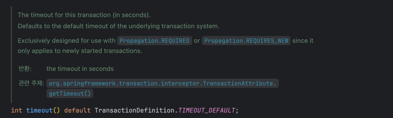
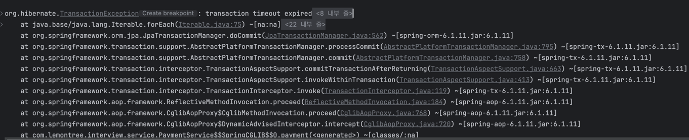
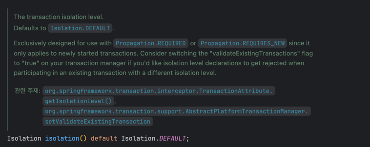
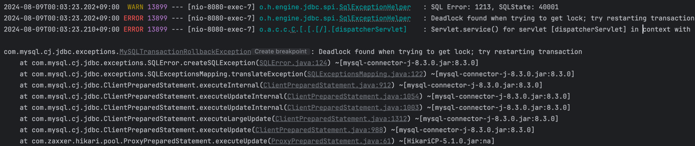
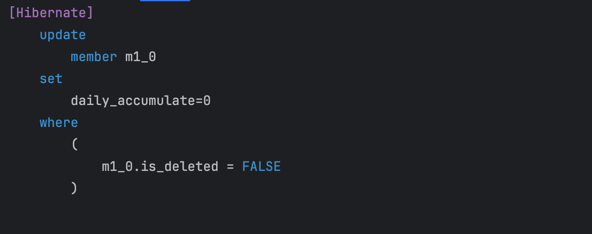

# 생각 정리

> 과제를 진행하면서 요구사항을 해결하기 위해 접근한 방법과 해결한 방법, 그리고 생각한 점들을 정리하였습니다.  
> 해결하지 못하였을 경우, 어떤 문제점이 있었는지 정리하였습니다.

## 누적 금액 초기화 (JPQL)

```java
public interface MemberRepository extends JpaRepository<Member, Long> {

    /**
     * 모든 유저의 일일 누적 금액(daily_accumulate)을 0으로 초기화합니다.
     */
    @Modifying(clearAutomatically = true)
    @Query(value = "UPDATE Member m SET m.dailyAccumulate = 0")
    void resetDailyLimit();


    /**
     * 모든 유저의 월간 누적 금액(monthly_accumulate)을 0으로 초기화합니다.
     */
    @Modifying(clearAutomatically = true)
    @Query(value = "UPDATE Member m SET m.monthlyAccumulate = 0")
    void resetMonthlyLimit();
}
```

회원의 일일/월별 누적 금액을 매일/매월 초기화시켜주는 쿼리를 작성하였습니다. _(Scheduler를 사용하여 매일/매월 초기화)_

- 작성한 후 과거에 `JPQL`을 사용할 때 주의해야되는 점이 '영속성 컨텍스트'를 사용하여 1차 캐싱하는 것이었습니다.
- `@Modifying` 어노테이션의 **clearAutomatically** 값을 true로 설정하면, 해당 쿼리를 실행 후 영속성 컨텍스트를 clear 하는 과정이 진행되어 데이터 불일치를 방지할 수 있습니다.

#### JPQL을 사용한 이유

- JPQL을 사용할 경우, 유지보수에 유연하며 코드 작성 시점에 오류를 잡을 수 있습니다.
- 또한, 객체지향적인 코드를 작성하고, DB에 종속되지 않는 코드를 작성할 수 있습니다.
- 결정적으로, **Soft Delete**를 사용하기 때문에, 탈퇴한 회원에 대한 불필요한 처리가 발생하지 않습니다.

- 물론, 속도적 측면에서 nativeQuery가 빠르고, Querydsl을 사용하여 컴파일 시점에 오류를 잡을 수 있지만, 단순 쿼리문 작성 시에는 JPQL을 사용하는 것이 유리하다고 판단하였습니다.

## 결제 - 격리 수준

> SERIALIZABLE 격리 수준은 성능이 상당히 떨어지기 때문에 '극단적'으로 안전한 상황에만 사용하라 했는데?..

- 결제 시스템의 경우 동시성 제어가 가장 중요하다.
- 특히, 요구사항처럼 어떤 상황에서든 1건당 1회가 일어나야 하는 경우 격리 수준을 높게 설정하는 것은 당연한 것 같다.

- READ UNCOMMITTED, READ COMMITED 격리 수준은 결제 시스템에 적합하지 않은 것 같다.
    - READ UNCOMMITTED: 커밋되지 않은 데이터를 읽을 수 있음. (dirty read)
    - READ COMMITTED: 커밋된 데이터만 읽을 수 있다. (non repeatable read)

그렇다면, REPEATABLE READ / SERIALIZABLE 둘 중 어느 격리 수준을 선택해야 할까?

#### REPEATABLE READ

- MySQL의 기본 격리 수준이며, 트랜잭션이 롤백될 가능성에 대비하여 변경 전 레코드를 Undo 영역에 저장
- 동일한 트랜잭션 내에서는 동일한 결과를 보장하지만, 다른 트랜잭션의 경우 팬텀 리드가 발생할 수 있다.
- 하지만, **InnoDB**를 사용하는 경우에는 REPEATABLE READ 격리 수준에서 팬텀 리드가 발생하지 않는다. (일반적인 SELECT 쿼리 한정)

#### SERIALIZABLE

- 가장 단순하고, 엄격한 격리 수준이다.
- 한 트랜잭션에서 읽고 쓰는 레코드를 다른 트랜잭션에서 **절대** 접근할 수 없다.
- 성능적으로 매우 떨어지기 때문에, 극단적인 상황이 아니면 사용하지 않는 것을 권장한다.

- 현재 InnoDB를 사용하고 있기는 하다. 따라서 팬텀 리드를 방지할 수 있고, 성능적으로도 REPEATABLE READ 격리 수준을 사용하는 것이 적합하다고 판단하였다.

> [과연 MySQL의 REPEATBLE READ에서는 PHANTOM READ 현상이 일어나지 않을까?](https://parkmuhyeun.github.io/woowacourse/2023-11-28-Repeatable-Read/)

## @Transactional 어노테이션

#### 1. timeout



- 거래 실행은 5초의 제한 시간이 주어진다.


시간이 경과하였을 경우 TransactionException 발생!

#### 2. isolation



- 동일한 결제/취소가 중복해서 일어날 수 있다.
- **REPEATABLE READ** 격리 수준과 **비관적 락(Pessimistic)** 을 사용하여 동시성 제어



- 동시에 여러 건의 결제가 발생했을 경우, Deadlock found when trying to get lock; try restarting transaction 에러 발생

_MemberRepository.java_

```java
public interface MemberRepository extends JpaRepository<Member, Long> {

    // ...

    /**
     * 유저 ID로 유저 정보를 조회합니다. (비관적 락 사용)
     *
     * @param id 유저 ID
     * @return 유저 정보
     */
    @Lock(LockModeType.PESSIMISTIC_WRITE)
    Optional<Member> findWithPessimisticLockById(Long id);
}
```

_PaymentRepository.java_

```java
public interface PaymentRepository extends JpaRepository<Payment, Long> {

    /**
     * 결제 ID로 결제 정보를 조회합니다. (비관적 락 사용)
     *
     * @param paymentId 결제 ID
     * @return 결제 정보
     */
    @Lock(LockModeType.PESSIMISTIC_WRITE)
    Optional<Payment> findWithPessimisticLockById(Long paymentId);
}

```

> 결제와 페이백 적립을 같은 트랜잭션으로 묶는게 맞을까?

## Scheduler


12시에 dailyAccumulate 초기화

```json
{
  "memberId": 1,
  "name": "정승조",
  "balance": 94000,
  "onceLimit": 5000,
  "dailyLimit": 10000,
  "monthlyLimit": 15000,
  "dailyAccumulate": 0,
  "monthlyAccumulate": 6000,
  "isDeleted": false
}
```

## 결제 취소와 페이백 취소 (Dirty Checking)

### 문제 상황

1. 결제 취소를 진행
2. 결제 취소 로직 중 결제의 상태를 `CANCEL`로 변경
3. 이후, 페이백도 진행된 경우, 페이백 서비스의 취소 메서드를 호출
4. 취소 메서드의 트랜잭션 내에서 결제 정보를 조회할 때 이미 `CANCEL`로 변경된 상태
5. 따라서, 페이백 취소 로직이 실행되지 않음

### 해결 방안

- PaymentStatus 수정 시점을 후순위로 변경

### 문제점

REQUIRES_NEW를 통해 개별 트랜잭션으로 분리하려고 하였지만, 비관적 락을 사용하여 동시성 제어를 하고 있기 때문에 같은 트랜잭션으로 묶이지 않는 이상, 오류가 발생함..

REQUIRES(default) 옵션을 사용하여 같은 트랜잭션으로 묶어서 처리하였지만 아래와 같은 문제점이 발생할 것으로 예상됨.

- 결제 취소와 페이백 취소가 1개의 트랜잭션으로 묶이다보니, 페이백 취소에서 문제가 발생하면 결제 취소도 안되버리는 큰 문제점이 존재함.
- 결제 취소와 페이백 취소를 각각 개별 트랜잭션으로 관리를 해야 할 것 같지만, 결제 취소 로직에서 회원에 대한 정보를 조회할 때 비관적 락을 사용하여 가져오기 때문에 무조건 오류가 발생하는 문제점이 계속해서
  존재
- 이러한 경우 동시성 제어를 어떻게 해야할지 고민이 필요함