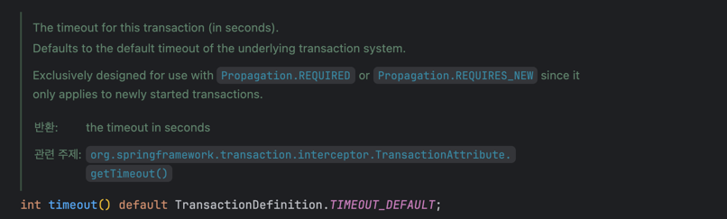
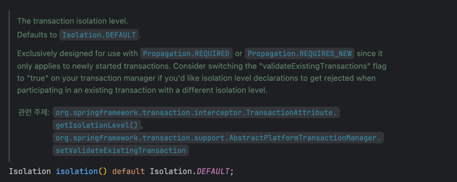
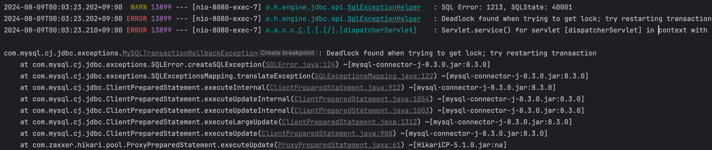

# 요구사항 분석

## 핵심 요구사항

- 거래를 진행할 때 오류가 발생하지 않는 것이 가장 중요하다.
- 하지만, 오류가 발생하더라도 어느 시점에서 발생했는지 파악할 수 있어야 한다.

### 돈 관련 타입 (BigDecimal vs Double vs Long)

- 현재 요구사항에는 결제 후 페이백을 지급하는 비즈니스 로직이 존재한다.
- 페이백이 고정된 값 (ex. 1000원)이 아닌, 일정 비율로 제공되어야 할 경우라면?
- float, double은 부동소수점 방식으로 인해 정확한 계산이 불가능함.
- BigDecimal은 정확한 계산이 가능하나, 무거운 객체이기 때문에 성능적인 측면에서 고려해야 함.

부동소수점의 한계를 가진 float, double을 사용하는 것은 적절하지 않은 것 같음.
할인율이나 페이백의 요구사항이 변경될 수 있다는 점 등 확장성을 고려하여 BigDecimal을 사용하는 것이 적절해보임.

성능적 측면에서 무거운 객체를 사용한다는 점은 문제가 되지만, '돈'과 관련된 API에선 정확성이 최우선이라고 판단

## 유저

> MySQL에서는 `user`라는 키워드가 존재하기 때문에 `member`로 대체합니다.

- 현재 보유 금액
- 상태 (가입 / 탈퇴)
- 보유 가능한 최대 한도가 존재 (유저마다 다름)
- 1회/1일/1달 결제 한도가 존재

### 나의 접근 방법

- 상태를 나타내는 변수 (`isDeleted`)를 Soft Delete 하는 방식으로 적용
- 결제 한도 필드 (`xxxLimit`) 를 통해 결제를 진행할 때 체크
- 또한, 일/월 누적 금액을 저장하는 필드 (`xxxAccumulate`) 를 통해 결제를 진행할 때 체크
- 누적 금액은 Spring Scheduling Task (`@Scheduler`) 사용하여 누적 금액 초기화

> 머니 결제 API 요청시 발생할 수 있는 예외
> 1. 잔액 부족
> 2. 1회 결제 한도 초과 (onceLimit)
> 3. 1일 결제 한도 초과 (dailyLimit)
> 4. 1달 결제 한도 초과 (monthlyLimit)

## 거래

- 중복 요청을 하는 상황 등 어떤 상황에서든 결제는 **1건당 1회!**
- 결제 실패시 **어느 시점**에서 실패했는지 파악 가능하게

#### 나의 생각

- 높은 격리 수준(**REPEATABLE READ**)을 사용
- `Lock` 을 사용하여 접근 권한을 제한하는 방식 사용
- 결제/페이백 시스템에서 `동시성 제어`가 가장 핵심적으로 판단
- 격리 수준과 락에 따른 **trade-off (dead lock)** 대응 방법은?

> **'결제 후 페이백을 진행한다.'**
> 1. 클라이언트가 결제 API 호출을 하면 서버 내부적으로 페이백까지 한 트랜잭션으로 처리
> 2. 클라이언트가 결제 API 호출 후 정상 응답일 경우 페이백 API 호출

### 결제

- 1회 결제 한도 초과
    - 유저의 1회 결제 한도와 결제 금액을 비교하여 초과했는지 확인

- 1일/1달 결제 한도
    - 유저의 누적 결제 금액과 비교하여 초과했는지 확인


### @Transactional



- 거래 실행은 5초의 제한 시간이 주어진다.


시간이 경과하였을 경우 TransactionException 발생!



- 동일한 결제/취소가 중복해서 일어날 수 있다.

## Scheduler


12시에 dailyAccumulate 초기화

```json
{
  "memberId": 1,
  "name": "정승조",
  "balance": 94000,
  "onceLimit": 5000,
  "dailyLimit": 10000,
  "monthlyLimit": 15000,
  "dailyAccumulate": 0,
  "monthlyAccumulate": 6000,
  "isDeleted": false
}
```

## ISOLATION - SERIALIZABLE



- 동시에 여러 건의 결제가 발생했을 경우, Deadlock found when trying to get lock; try restarting transaction 에러 발생

---

결제와 페이백 적립을 같은 트랜잭션으로 묶는게 맞을까?

결제를 해야 페이백을 지급하는 방식이므로 같은 트랜잭션으로 묶는게 맞다고 생각하는데

